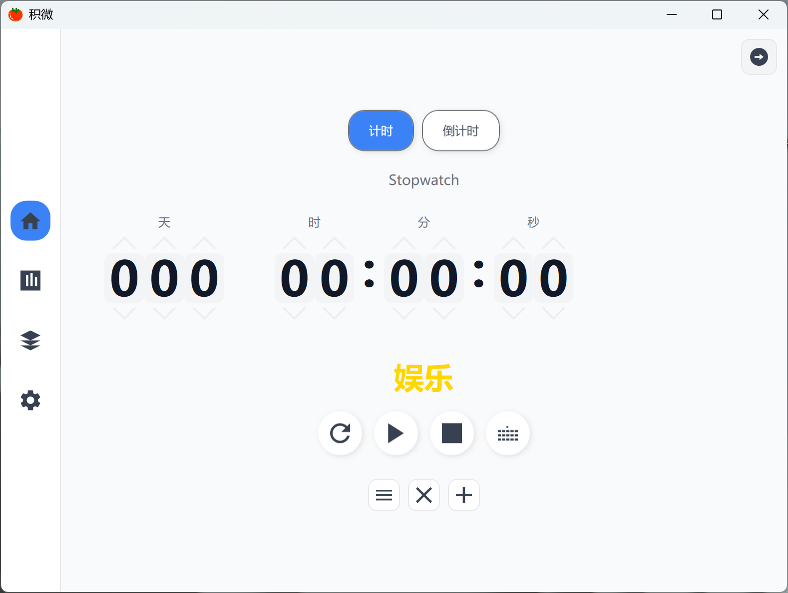
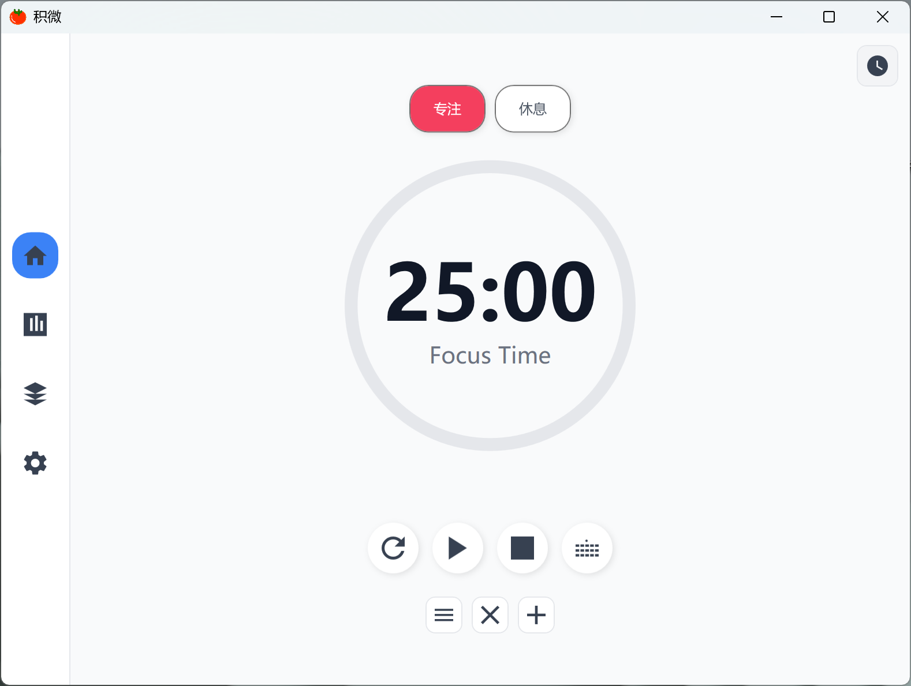
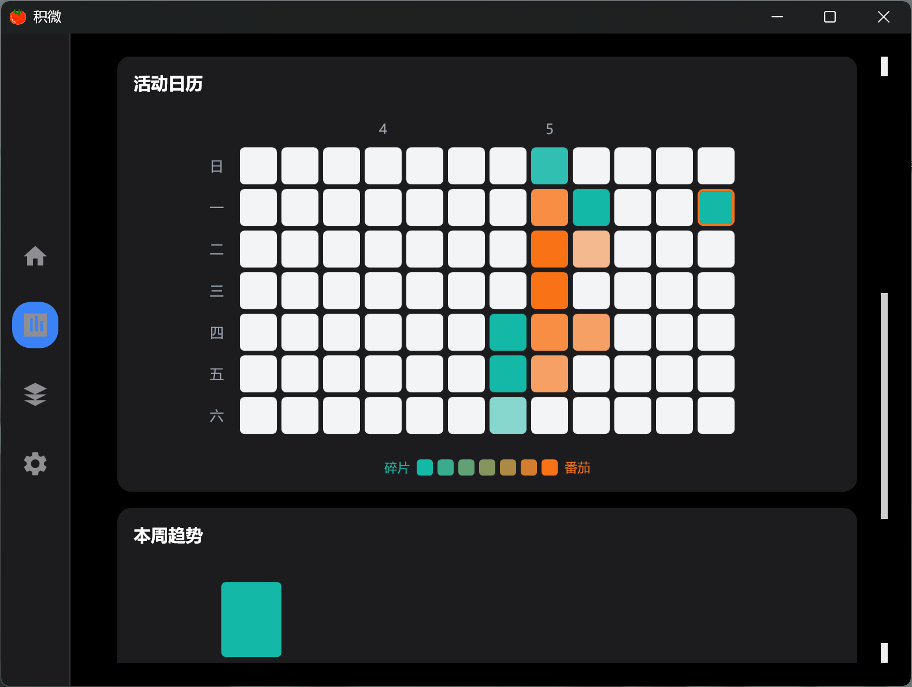
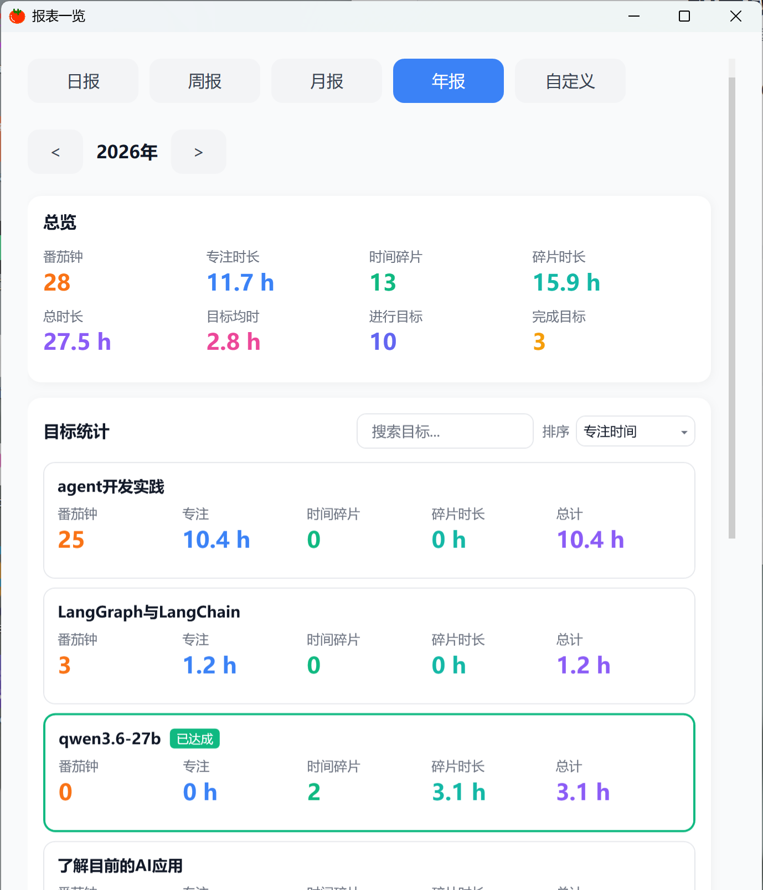
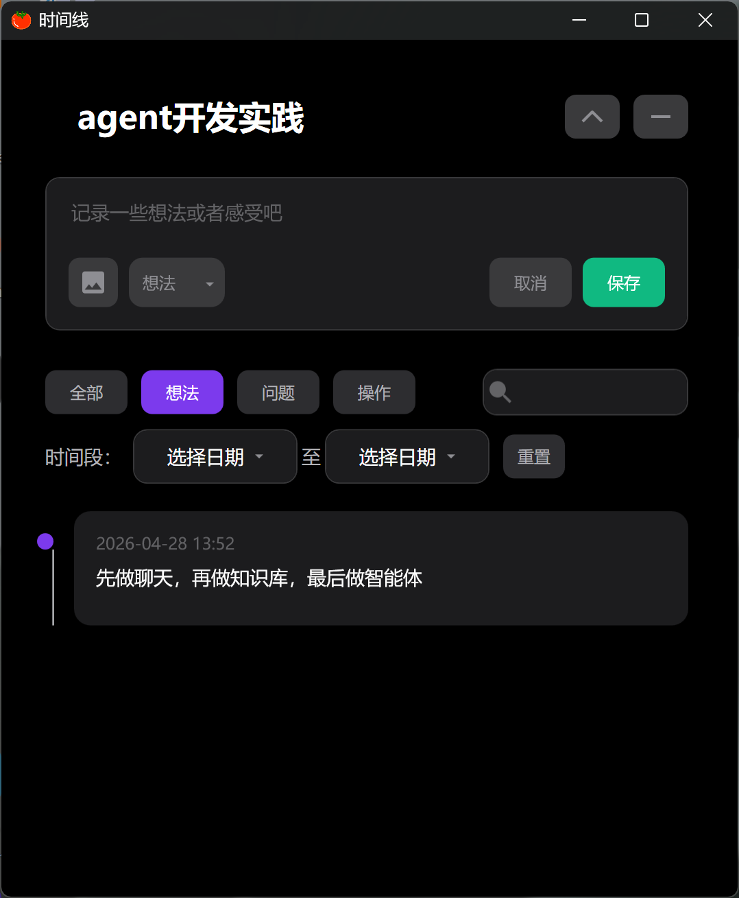

# 积微

> 积微成著，专注当下 —— 一款 WPF 桌面专注与时间管理工具。

## 功能特性

- **番茄钟 / 秒表 、倒计时** — 番茄钟与计时模式，满足不同专注场景，可设置计时目标
- **目标管理** — 创建、编辑、删除目标等，右键菜单操作，支持子目标
- **悬浮窗** — 迷你计时器悬浮窗小组件，随时查看计时与快捷记录操作。点击竖线可展开收起，点击小组件按enter进入快捷记录小窗口（shift+enter换行，enter完成）
- **时间线记录** — 详细记录每个目标的时间投入，想法，问题，支持文本/图片
- **数据统计** — 热力图、日报/周报/月报/年报，可视化你的时间分布
- **白噪音 & 提示音** — 内置白噪音辅助专注，可设置提示音，白噪音
- **深色/浅色主题** — 支持主题切换
- **系统托盘** — 最小化到系统托盘，后台静默计时，系统托盘右键可显示与隐藏小组件和主界面

## 应用截图

| 计时器                        | 番茄钟                        |
| -------------------------- | -------------------------- |
|  |  |

| 目标管理                           | 统计页面                         |
| ------------------------------ | ---------------------------- |
|  |  |

| 热力图                        | 日报/周报/月报/年报                  |
| -------------------------- | ---------------------------- |
|  |  |

| 时间线                          | 悬浮窗                          |
| ---------------------------- | ---------------------------- |
|  |  |

| 设置页面                       | <br /> |
| -------------------------- | ------ |
|  | <br /> |

## 技术栈

- .NET 8.0 / WPF
- System.Text.Json（数据持久化）
- MVVM 架构
- Windows 系统托盘 / 悬浮窗

## 项目结构

```
积微/
├── Models/            # 数据模型
├── Services/          # 业务服务（计时、统计、存储、音频）
├── ViewModels/        # MVVM 视图模型
├── Views/             # 窗口与页面
├── Controls/          # 自定义控件
├── Converters/        # 值转换器
└── Helpers/           # 工具辅助类
```

## 快速开始

1. 安装 [.NET 8.0 SDK](https://dotnet.microsoft.com/download/dotnet/8.0)
2. 克隆仓库：
   ```bash
   git clone https://github.com/your-username/your-repo.git
   cd your-repo/积微
   ```
3. 运行项目：
   ```bash
   dotnet run
   ```

## 许可证

[MIT](LICENSE)
